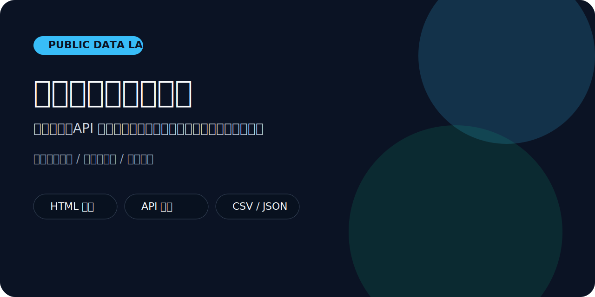

# 公开数据采集实验室




这个仓库聚焦“公开数据采集”的完整教学链路：从页面解析、API 数据整理，到结构化导出和清洗规则设计。它适合做课程案例、作品集样板和技术分享素材。

## 这个仓库适合谁

- 想系统学习公开数据采集的人
- 想把采集结果进一步用于数据分析的人
- 需要安全、可控、可演示案例的培训讲师

## 当前包含的案例

1. 本地 HTML 页面解析演示
2. API 响应清洗与导出案例

## 你会学到什么

- 如何把采集逻辑和解析逻辑拆开
- 如何用 `BeautifulSoup` 做结构化页面提取
- 如何对 API 返回数据做标准化、去重和标签清洗
- 如何把结果导出为 CSV / JSON，便于下游分析

## 仓库结构

- `src/public_data_collection/fetcher.py`：本地 / HTTP 数据加载
- `src/public_data_collection/parser.py`：HTML 页面解析
- `src/public_data_collection/cleaners.py`：API 数据清洗与标准化
- `src/public_data_collection/exporters.py`：CSV / JSON 导出
- `examples/sample_articles.html`：页面解析样例
- `examples/sample_api_response.json`：API 数据样例
- `examples/run_demo.py`：HTML 解析演示
- `examples/run_api_demo.py`：API 清洗演示

## 快速开始

```bash
pip install -r requirements.txt
python examples/run_demo.py
python examples/run_api_demo.py --keyword python
```

## 为什么这个仓库值得 Star

- 既能讲页面采集，也能讲 API 数据处理
- 样例都是本地可跑的，适合课堂和公开视频
- 代码结构清楚，便于你继续扩展成更完整的项目

## 合规说明

这个仓库用于公开信息场景、教学演示和研究实践。请始终尊重站点协议、robots 规则、法律边界以及平台条款。

## 仓库维护

- 开源协议：`MIT`
- 更新记录见 `CHANGELOG.md`
- 贡献方式见 `CONTRIBUTING.md`
